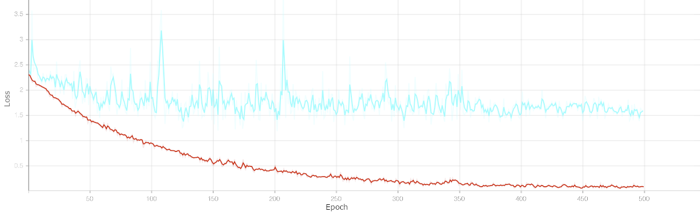

# Development of a 3D-CNN for ASL Gesture Recognition

Developed by Aidan Carter for GH401 Honors Thesis

## Purpose

This project presents an overview of the development and training of a 3D Convolutional Neural Network (3D-CNN) for American Sign Language gesture recognition. The model is designed to classify a subset of 10 ASL gestures using short video sequences, with a focus on balancing model accuracy and computational efficiency. 

Due to hardware constraints, the model was designed to be shallow and lightweight, significantly reducing the number of trainable parameters and thus reducing the memory requirements during training. Despite being compact, the model aims to extract meaningful information from both spatial and temporal features, enabling the classification of gestures from videos outside of the training dataset.

The goal is to demonstrate that meaningful gesture recognition can still be achieved in smaller networks and can then be scaled up to classify larger vocabularies. This can then pave the way for 
future, real-time ASL gesture recognition projects.

## Feeding the Network

|  |
|:--:|
| *Figure 1. Organization of dataset sample in JSON format from [^1].* |
### Dataset Overview

- The MS-ASL dataset is comprised of 25,513 samples split between training, validation, and testing sets [^1].

- Each sample contains the classification label, video link, bounding box  of the signer, and start and end time of the gesture (see Figure 1).

- A subset of 10 ASL gestures was used, with 328 training samples, 108 validation samples, and 84 testing samples.

- Each downloaded video was processed and saved in RGB and Optical Flow variations. 

### Preprocessing

- Each video was cropped to the bounding box of the signer. This was done  by calculating the pixel crop based on the resolution of the video and  the normalized values supplied in the sample (see Figure 1).

- Cropped videos were then resized to `224 x 224` pixels to fit the dimensions of the model. The RGB frames are written to build the cropped and   resized video and saved to the disk (see Figure 3).

- Each frame is converted to grayscale and optical flow is calculated using the Farneback method [^2]. Optical flow frames are then saved to the disk (see Figure 4).

|  |
|:--:|
| *Figure 2. Optical flow frame calculation code snippet. Implementation adapted from [^2].* |

|  |  |
|:--:|:--:|
| *Figure 3. RGB frame from [^1].* | *Figure 4. Calculated flow frame.* |

## Building the Brain

|  |
|:--:|
| *Figure 5. Simplified 2D view of the network based on a single frame. Visualization generated from [^3]* |

### Model Architecture

- The model was designed using the PyTorch, an open-source deep learning framework. This was optimal for implementing a 3D-CNN [^4].

- Input of the model is structured in a tensor with the following dimensions: `[Batch,Channel,Frame,Width,Height]`.

- The initial convolution layer of the model uses a kernel size of `(3,7,7)` with stride `(1,2,2)` to effectively capture spatial and temporal features, while reducing the spatial resolution to cut down on the number of computations early in the network, without losing temporal information. The 3 color channels dimension is increased to 32 feature maps.

- A Max-Pooling layer follows, with kernel size `(1,3,3)` and stride `(1,2,2)` which further reduces the spatial dimension and cuts down on computation and memory requirements.

- Subsequent convolutional layers use kernel size of `(3,3,3)` with stride `(1,1,1)` to extract features from previous feature maps. A Max-Pooling layer with kernel `(2,2,2)` and stride `(2,2,2)` is present as well to reduce the size of the feature maps. The number of feature maps increases from 32 to 256 throughout these layers. 

- An Average-Pooling layer reduces the feature maps into a tensor of size `[Batch,256,1,1,1]` which is flattened into `[Batch,256]`

- The `[Batch,256]` sized tensor is then fed into a dropout layer to reduce overfitting by randomly deleting 40% of the activated neurons in the layer. This promotes the model to generalize and perform better on unseen data. It is then fed into a fully connected layer to map the features extracted to a label, effectively classifying the data.

- Each convolutional layer is followed by a batch normalization layer to stabilize batched training.

### Training Pipeline

- Batches of 4 videos are loaded from the disk and processed into tensors of size `[4,3,64,224,224]`. Videos longer than 64 frames use a random start point, while shorter videos are extended. Video are augmented with random rotations, color jitter, and horizontal flips to reduce overfitting.

- The tensor is then fed to the model for a forward pass. The model then outputs unnormalized values called logits.

- The output logits are fed into the CrossEntropyLoss function, which calculates the prediction error. Gradients are then computed and back propagated through the network.

- The `AdamW` optimizer is used to update the parameter weights based on the gradients. An initial learning rate of 10-3 was used, with the `CosineAnnealingLR` scheduler reducing the learning rate after each epoch, to a minimum of 10-8.

- A standard train/validate loop was performed for 500 epochs, with the training and validation loss and accuracy recorded each epoch (see Figure 6 & Figure 7). The mode with the highest validation accuracy was noted and saved to the disk.

- All training, validation, and testing was performed using GPU acceleration. Along with mixed-precision floating point values, the training was able to be performed with limited computing power and memory available in a manageable amount of time. `CPU: i7-4770k  GPU: GTX 1070-8GB  RAM: 16GB`

|  |
|:--:|
| *Figure 6. Loss per Epoch. Training loss is visualized in red, while validaiton loss is visualized in blue. Generated by [^5].* |
|  |
| *Figure 7. Accuracy per Epoch. Training accuracy is visualized in red while validation accuracy is visualized in blue. Generated by [^5].* |

## Signs of Success

|  |
|:--:|
| *Figure 8. Confusion matrix showing model predictions vs true classification. Generated by [^6].* |

### Results

- The best performing model that was chosen had a validation accuracy of 71.429% based on optical flow input data. Testing was performed on this model to generate a final accuracy and loss for the model, as well as a confusion matrix to visualize underperforming classes.

- The results of testing were a 72.840% accuracy with am average loss of 1.570432 This shows the model had learned useful features from the data! (Guessing at random would be 10% accuracy with loss of ~2.3)

- The confusion matrix shows the model is making accurate predictions for most of the classes (see Figure 8). Labels like `Nice`, `Teacher`, and `Eat` are accurately predicted 100% of the time. However, classes like `Hello`, `Want`, and `Deaf` are often confused between 40-60% of the time. The label for `Orange` was the worse performer, which is understandable due to similarities in how it is gestured to `Eat`.

### Next Steps

- The next steps for the model is to increase the size of the training subset to allow for a larger vocabulary. This will make the model more practical for real-world use cases.

- The inference time of the model was tested on both the CPU and GPU. CPU time was ~0.48s and GPU time was ~0.13s. Both are very reasonable to perform real-time gesture recognition in applications.

[^1]: H. R. Vaezi Joze and O. Koller, “MS-ASL: A large-scale data set and benchmark for understanding American Sign Language,” in Proc. British Machine Vision Conference (BMVC), Sept. 2019.

[^2]: G. Bradski, “Optical Flow,” OpenCV Documentation, Open Source Computer Vision Library, [Online]. Available: https://docs.opencv.org/3.4/d4/dee/tutorial_optical_flow.html [Accessed: Oct. 2, 2024].

[^3]: A. LeNail, “NN-SVG: Publication-ready neural network architecture schematics,” J. Open Source Softw., vol. 4, no. 33, p. 747, 2019. [Online]. Available: https://doi.org/10.21105/joss.00747

[^4]: J. Ansel et al., “PyTorch 2: Faster Machine Learning Through Dynamic Python Bytecode Transformation and Graph Compilation,” in Proc. 29th ACM Int. Conf. Architectural Support for Programming Languages and Operating Systems, Vol. 2 (ASPLOS '24), Apr. 2024. [Online]. Available: https://doi.org/10.1145/3620665.3640366

[^5]: M. Abadi et al., “TensorFlow: Large-scale machine learning on heterogeneous systems,” 2015. [Online]. Available: https://www.tensorflow.org. [Accessed: Jan. 31, 2025].

[^6]: J. D. Hunter, “Matplotlib: A 2D graphics environment,” Comput. Sci. Eng., vol. 9, no. 3, pp. 90–95, 2007. [Online]. Available: https://doi.org/10.1109/MCSE.2007.55
